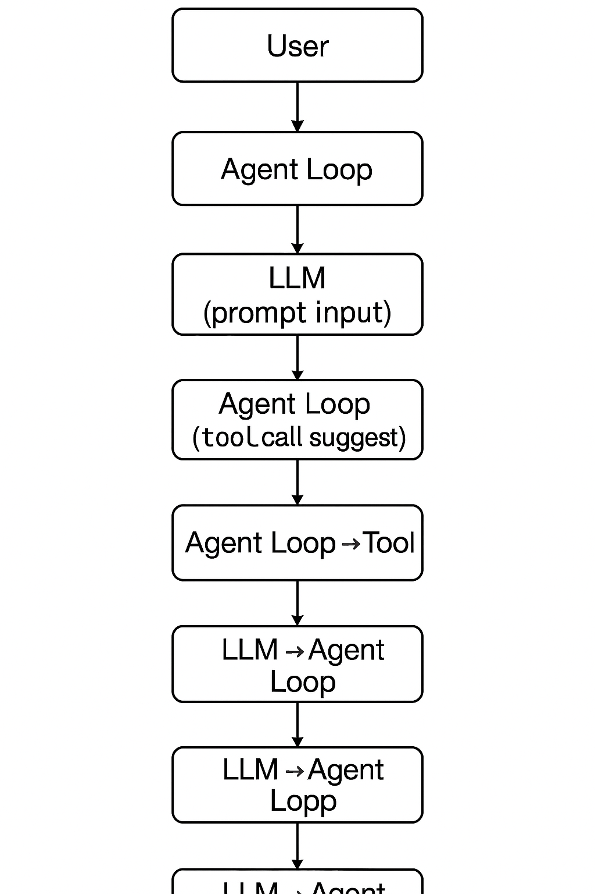

## 💬 Chat Completion Kya Hai?

Chat Completion ka matlab hai:
Jab tum kisi model (jaise GPT-4) ko ek chat-based format mein kuch prompt dete ho (messages ka sequence), toh model uska jawaab deta hai — isko chat completion kehte hain.

Example:

```python
[
  {"role": "user", "content": "Assalamualaikum, tum kaun ho?"},
  {"role": "assistant", "content": "Walikumassalam, main ek AI assistant hoon!"}
]
```

Tum ek conversation ka hissa doge aur model uska continuation karega — isse chat completion bola jata hai.

---

## 🧠 LLM Stateless Kya Matlab Hai?

Stateless ka matlab hota hai:

Model ko yaad nahin rehta ke pichli baar kya conversation hui thi — jab tak tum use puri history na do.

Matlab:
Agar tum GPT ko ek baar poochho:

"Mera naam Zain hai",
aur agle prompt mein poochho
"Mujhe kal kya bataya tha?",

toh model yaad nahi rakhega jab tak tum “Mera naam Zain hai” bhi saath mein na bhejo.
Model ka koi internal memory nahi hoti — ye stateless hai.

---

## 🧰 Tool Calling Kya Hai?

Tool calling ka matlab hai:

Model sirf text generate karne ke bajaye, kisi external tool (function, API, calculator, etc) ko call karke uska result bhi le sakta hai.

### 🧠 Example:

Agar user bole:

“Mujhe aaj ka weather btao Karachi ka”

Model khud API call karega:

```python
get_weather("Karachi")
```

Aur result le kar jawaab dega.

⚙️ Ye bahut powerful feature hai — jahan model real-world tools ke sath interact karta hai.

---

## 🌐 REST API Kya Hai?

REST API ka matlab hota hai:

Ek system jahan tum web ke zariye (HTTP) kisi aur app/service se data maang saktay ho ya bhej saktay ho.

### Example:

Tum OpenAI ke model ko use karna chahtay ho — toh tum:

```python
POST https://api.openai.com/v1/chat/completions
```

pe request bhejogay, aur response milega model ka jawab.

🧾 Ye standard tariqa hai web services ko access karne ka.

---

## 🔄 Agent Loop Kya Hai? Background Mein Kaise Kaam Karta Hai?

Agent Loop ka matlab hai:

Tumhara AI agent har step mein sochta hai:

* Mujhe user ne kya poocha?
* Kya mujhe koi tool use karna chahiye?
* Agar haan, tool call karo
* Uska response dekho
* Phir final response do ya agla step chuno

🔁 Ye loop chalta rehta hai jab tak task complete na ho jaye.

⚙️ Background mein:
Har step mein model decide karta hai:

"kya main khud se jawab doon ya kisi tool se poochho?"

Phir uska result check karke agla action plan karta hai.

---

## 🏗️ OpenAI SDK Kyun Bana? Kuch History

OpenAI SDK banaya gaya:

Developers ke liye aasani se LLMs, agents, tools, memory, aur workflows handle karne ke liye.

### 📜 History:

Pehle developers ko manually sab kuch likhna padta tha:

* Prompt banana
* Tool integrate karna
* Chain ya memory structure design karna

Ab SDK ne ye sab simplify kar diya:

* ✅ Easy tool calling
* ✅ Memory integration
* ✅ Agent loop handling
* ✅ Streaming & Function support
* ✅ LangChain/Chainlit se better direct integration


📦 SDK Mein Kya Kya Hai:
OpenAI (model access)

Assistant (Agent + tools + memory)

Tool (function define karne ke liye)

Runnable (flow design)

File, Thread, Message (memory ke liye)

Stream (realtime response)


---
### Question raised?
YAgent Loop tool calling kar raha hota hai.
Agar user ne koi question poocha, to pehle woh LLM ke paas kaise jaata hai?
Kya pehle LLM hota hai, ya REST API?
Uske baad Chat Completion aata hai, phir Agent Loop SDK activate hota hai?
Toh exact process kya hai? Kis order mein ye sab kuch hota hai?

ChatGPT said:
Bohat zabardast sawal hai! Tum ye samajhna chah rahe ho ke LLM, REST API, Chat Completion, aur Agent Loop ka actual connection kya hai — pehle kya hota hai, baad mein kya, aur data flow kaise hota hai.

---

## 🔄 FULL AGENT PROCESS KA FLOW:
🧑‍💻 User ka Input:
User kehta hai:

“Karachi ka mausam btao”

📤 Step 1: SDK ya App ka Layer (jaise OpenAI SDK, LangChain etc)
Yeh user ka message le kar banata hai ek message history (chat format):

python
```
[
  {"role": "user", "content": "Karachi ka mausam btao"}
]
Yeh message ab jaata hai LLM (GPT-4) ke paas.
```
## 🧠 Step 2: LLM + Chat Completion API (Stateless)
OpenAI ka Chat Completion API is prompt ko receive karta hai.

Model yeh sochta hai:

"Kya main directly jawab doon ya kisi function/tool ko call karna chahiye?"

Agar tool calling enabled hai (via OpenAI SDK ya manually function definition di hui hai), toh model reply deta hai:


python
```
{
  "tool_call": {
    "function": "get_weather",
    "arguments": {
      "city": "Karachi"
    }
  }
}
```
Yeh response hota hai function call (tool call).

## 🧰 Step 3: Agent Loop (SDK ka backend loop)
Yeh OpenAI SDK ka agent loop yeh dekhta hai:

LLM ne tool call suggest kiya

Agent ke pass get_weather() naam ka tool (Python function) defined hai

Toh yeh SDK call karta hai:

python
```
get_weather("Karachi") → "Aaj Karachi ka darja hararat 34°C hai"
```

## 🔁 Step 4: Tool ka Result Wapis LLM Ko Jata Hai
SDK tool ka result wapis LLM ko deta hai as:

python
```
[
  {"role": "user", "content": "Karachi ka mausam btao"},
  {"role": "tool", "name": "get_weather", "content": "Aaj Karachi ka darja hararat 34°C hai"}
]
```

## 🤖 Step 5: LLM Final Response Deta Hai (Completion)
Ab LLM ka final response aata hai:

“Aaj Karachi ka darja hararat 34°C hai, halke badal hain.”

Ye final answer tumhare user ko milta hai.

User Input → SDK → LLM (Chat Completion API) 
         → [Tool Call] → Agent Loop → Tool Function 
         → Result → LLM → Final Response → User

## 📌 Important Notes:
Term	Kya Hai
LLM	GPT-4 model jo language samajhta hai
Chat Completion	Wo endpoint jisse model ko prompt bhejte hain
Tool Calling	Jab model decide karta hai ke koi tool (function) call karna hai
Agent Loop	Ek SDK ka system jo har step pe sochta hai: tool call karna hai ya nahi, aur result se kya karna hai
Stateless	LLM ko pichla context nahi yaad rehta jab tak explicitly na bhejo
REST API	Web request jahan tum model ko prompt bhej kar jawab lete ho

---

#### sawal ye hai ke:
Agar user ne koi input diya, toh pehle yeh input Agent Loop ke paas jaata hai. Agent Loop is input ko LLM ko forward karta hai. LLM phir decide karta hai ke kya is input ko solve karne ke liye kisi tool ki zarurat hai ya nahi. Agar tool ki zarurat hoti hai, toh LLM Agent Loop se poochta hai ke kya required tool available hai. Agar tool available hota hai, toh Agent Loop us tool ko call karta hai. Tool ka output wapas Agent Loop ke zariye LLM tak jaata hai. LLM user ke original input aur tool ke result dono ko dekh kar final answer generate karta hai, jo phir user ko diya jaata hai ?

#### ChatGPT said:
Bohat zabardast! ✅ Tumne almost bilkul sahi samjha hai, bas chhoti si clarification chahiye. Chalo step-by-step clarify karta hoon tumhare flow ko:
---

✅ Tumhara Sawal (Simplified):
Kya flow kuch aisa hai?
User → Agent Loop → LLM → Tool Check → Agent Loop → Tool Call → Result → LLM → Final Answer → User

✅ Bilkul sahi! Yeh hi overall structure hai — thoda detail mein samajh lo:

### 1️⃣ User Input Deta Hai
User ne kaha:

“Mujhe Karachi ka mausam btao”

### 2️⃣ Agent Loop ko Ye Message Jata Hai
Agent loop yeh input LLM (GPT-4 etc.) ko bhejta hai Chat Completion API ke zariye.

### 3️⃣ LLM Decide Karta Hai:
LLM internally yeh check karta hai:

“Kya mujhe directly jawab dena chahiye ya koi external function/tool call karna chahiye?”

Agar tool definitions diye gaye hain (jaise get_weather(city: str)), toh LLM tool call suggest karta hai.

### 4️⃣ LLM Ka Response Agent Loop Ko Milta Hai:
LLM yeh kehta hai:

python
```
{
  "tool_call": {
    "name": "get_weather",
    "arguments": { "city": "Karachi" }
  }
}
```

### 5️⃣ Agent Loop Actual Tool/Function Call Karta Hai
Yahan agent loop ke pass woh tool defined hota hai (jaise Python ka function get_weather).

Wo function run hota hai:

python
```
get_weather("Karachi") → "34°C with light clouds"
```

### 6️⃣ Result Wapis Agent Loop → LLM ko Jata Hai
Yeh response wapis model ko bheja jata hai as new message (role: tool):

python
```
{"role": "tool", "name": "get_weather", "content": "34°C with light clouds"}
```

### 7️⃣ LLM Final Answer Compose Karta Hai
LLM ab kehta hai:

“Aaj Karachi ka darja hararat 34°C hai, aur halke badal hain.”

### 8️⃣ User Ko Final Response Milta Hai
📌 To Summary:
User → Agent Loop → LLM → Tool Call Suggest → Agent Loop → Tool Call → Result → LLM → Final Answer → User

### 📘 Fun Way to Remember:
Step	Kaam
👤 User	Sawal poochta hai
🔁 Agent Loop	Message bhejta hai LLM ko
🧠 LLM	Decide karta hai ke tool chahiye ya nahi
🛠️ Tool Call	Agent loop actual function call karta hai
💬 LLM	Final response banata hai
📤 Response	User tak wapis bhej diya jata hai


LLM → Tool Call Suggest
iska matlab hota hai: LLM ne suggest kiya ke koi tool call hona chahiye — actual call LLM nahi karta, balki agent loop karta hai.

### 🔄 To theek flow aise likhna chahiye:
Step	Who initiates	Who executes
✅ User → Agent Loop	(User input)	
✅ Agent Loop → LLM	(Send input)	
✅ LLM → Agent Loop	"Tool call suggested"	
✅ Agent Loop → Tool	(LLM ke kehne pe actual call)	
✅ Tool → Agent Loop	(Tool ka result wapas)	
✅ Agent Loop → LLM	(Tool result wapas bheja)	
✅ LLM → Agent Loop	(Final answer ready)	
✅ Agent Loop → User	(Final answer shown)	


- LLM sirf suggest karta hai ke "mujhe yeh tool call chahiye."

- Agent loop check karta hai: "Acha, LLM keh raha hai tool get_weather ko call karo."

- Agent loop actual function ko call karta hai.

- Result milke wapas LLM ko diya jata hai.

- LLM final response banata hai.

- User ko final output milta hai.


## Tumhara agent loop ka sawal + arrows ka confusion dono bahut valid hain. Chalo step by step clearest possible way mein samjhta hoon —  Roman Urdu + arrows + full logic + reason behind "loop" ka naam.

### ✅ Sabse pehle: "Agent Loop" naam kyu hai?
- Agent loop ko loop is liye kehte hain kyun ke:

- Wo baar baar LLM ko input deta hai, uske output ko parse karta hai

- Agar LLM bolta hai: “Tool chahiye”, toh tool call karta hai

- Wapas LLM ko deta hai, wo phir response dega

- Agar LLM phir bolta hai dusra tool chahiye → phir call hoga

- Yeh chakkar tab tak chalta hai jab tak final answer na ban jaye

- 👉 Isliye Agent loop = ek chakkar ya loop jo:

- LLM → tool → LLM → tool ... → final answer

### ✅ Arrows with full explanation (ek ek step):
#### Step #	Action	Arrow	Meaning
- 1	User input deta hai	🧑‍💻 User → Agent Loop	Tumhara sawal gaya agent ke paas
- 2	Agent loop input deta hai LLM ko	🔁 Agent Loop → LLM	“Yeh user ka prompt hai, jawab do”
- 3	LLM suggest karta hai tool call	📤 LLM → Agent Loop	LLM bolta hai: mujhe get_weather() chahiye
- 4	Agent loop tool call karta hai	🔧 Agent Loop → Tool	Agent tool run karta hai
- 5	Tool return karta hai result	📩 Tool → Agent Loop	Result wapas milta agent ko
- 6	Agent loop deta hai yeh LLM ko	🔁 Agent Loop → LLM	Tool result de diya LLM ko
- 7	LLM banata hai final reply	🧠 LLM → Agent Loop	LLM kehta hai: “yeh lo final jawab”
- 8	Agent loop deta hai user ko	📤 Agent Loop → User	Tumhe final result milta hai


<p align="center">
  
</p>


---
### ✅ Bonus: Yeh Loop Kab Tak Chalta Hai?
- Agent loop yeh check karta hai:

- Agar LLM ne bola: tool_call chahiye → tool call karo

- Agar LLM ka jawab final hai (i.e. "finish_reason": "stop") → stop loop

- Is chakkar ko hi agent loop kehte hain, aur yeh behind the scenes chal raha hota hai (OpenAI SDK ya LangChain agent mein)

- Batao ab clear hua?

- Chaho tu mein ye arrows + explanation ek proper README file + diagram ke form mein bana deta hoon for your repo. ✅


## 🧠 Memory in Agents (Roman Urdu Explanation):
Jab koi agent ya chatbot banate hain, to wo aksar stateless hota hai – iska matlab hai ke har dafa jab user input deta hai, to model purani baat bhool jata hai.

Lekin agar aap chahte hain ke model ko pehle ki conversation ya data yaad rahe, to aap "memory" use karte hain.

### 🔄 Memory ka Kaam Kya Hai?

#### Example:
User: "Mera naam Ali hai."
Agle input: "Mujhe kal kya bataya tha?"
Agar memory use ho rahi hai to model kahega: "Aapne bataya tha ke aapka naam Ali hai."

### 🔍 Agent ke Context Mein Memory
- Agar aap OpenAI Agents SDK ya LangChain jaise tools use kar rahe ho, to memory help karti hai:

- User ke pehle ke sawalon aur jawab yaad rakhne mein

- Tool outputs ya important data ko yaad rakhne mein

- LLM ko context dene mein for better answers

### 🧱 Memory ke Types:
ConversationBufferMemory – Simple chat history store karta hai

SummaryMemory – Pehle ki conversation ka summarized version banata hai

VectorStoreMemory – Advance form jahan semantic understanding ke sath data ko retrieve kiya jata hai (e.g. using embeddings)

### 🎯 Kyu Use Karein?
- Context yaad rahta hai

- User ke liye better personalized response milta hai

- Tool output track karne mein madad milti hai

- Task ko multi-step banane mein helpful hota hai


## kia SDK memory provide karta hai khud se?

Haan ✅ — OpenAI Agent SDK khud se memory ka system provide karta hai, aur wo bhi built-in tareeqe se. Tumhein manually memory banani nahi padti agar tum SDK ka structure follow kar rahe ho.

### 🧠 Kaise Memory kaam karti hai OpenAI Agent SDK mein?
- Jab tum ek Agent create karte ho using OpenAI SDK, to:

- Agent loop automatically tumhare har user input ko track karta hai.

- Har interaction ke context ko auto-save karta hai.

- Jab LLM ko response generate karna hota hai, to ye pehle wali conversation (memory) ko context ke taur par LLM ko deta hai.

- Agar koi tool call kiya gaya ho, to uska output bhi yaad rakhta hai.

#### ✅ Iska Matlab:
Tum kuch aise likhte ho SDK mein:

python
```
@agent()
def my_agent():
    ...
```
Tumhe explicit memory define karne ki zarurat nahi — SDK background mein context store kar raha hota hai (ye hi "memory" hai).

### ❓Agar Tum Customize Karna Chaho To?
- OpenAI SDK allow karta hai:

- Session-based memory (ek user ki poori session ke liye)

- Future mein customizable memory backends (like Redis, vector DBs, etc.)

#### 📌 Real Use Example:
python
```
@agent()
def support_bot():
    name = user.input("What is your name?")
    user.say(f"Hello {name}, how can I help you?")
   ```
Agar agle step mein tum user se naam maango to agent ko yaad rahega ke pehle user ne "Ali" bataya tha — ye hi memory hai jo SDK handle karta hai.


## tu agent loop ya sdk memroy rakh raha hota humne khud se coding kark nh bananai parti❓

Bilkul sahi samjha tumne! ✅

🔁 Agent Loop ya SDK hi memory ka khayal rakhta hai, humein manually koi extra memory system nahi likhna padta.
🔍 Thoda aur Detail mein:
💡 Jab tum yeh likhte ho:
python
```
@agent()
def my_agent():
    ...
   ```
#### -> To OpenAI Agent SDK:

- Har user ka input auto-save karta hai

- Uske response ya tool output bhi track karta hai

- LLM ko jab answer generate karna hota hai, to pehle ki conversation ko context ke taur pe use karta hai

⚙️ Ye sab automatically background mein agent loop kar raha hota hai. Tumhein sirf apna logic likhna hota hai — memory management SDK sambhal leta hai.

#### 🔧 Tumhe memory tab banana padti hai:
- Agar tum SDK use nahi kar rahe

- Ya tum custom memory store (e.g. vector DB, Redis, file-based logs) banana chahte ho

- Ya tum chahte ho ke LLM sirf kuch specific cheezein yaad rakhe

### ✅ To short mein:
- * Feature	SDK karta hai?
- * User ke inputs yaad rakhta hai	✅ Yes
- * Tool call results yaad rakhta hai	✅ Yes
- * LLM ko context deta hai	✅ Yes
- * Humein manual memory likhni padti	❌ Nahi (unless custom chahiye)

---

<div align="center">

✨ _This journey through intelligent agents was carefully documented by_  
### **✍️ Jawaid Ali**  
_Pushing the boundaries of code & cognition_ 🚀

</div>
